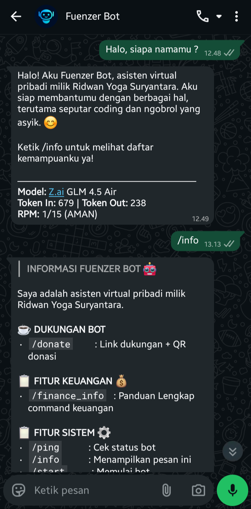
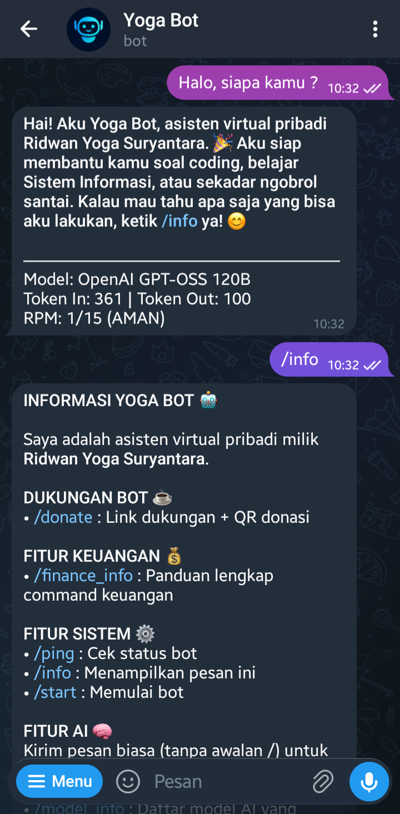

<p align="center">
  
  
  
  
  
</p>

<p align="center">
  
</p>

<h1 align="center">Personal Bot Core - Fuenzer Bot</h1>

<h4 align="center">
    <a href="README.md">English</a> | <a href="README.id.md">Indonesia</a>
</h4>

<p align="center">
  <a href="https://ko-fi.com/fuenzer">
    
  </a>
  <a href="https://saweria.co/fuenzer">
    
  </a>
</p>

Fuenzer Bot adalah asisten virtual mandiri yang berjalan secara paralel di WhatsApp dan Telegram. Dirancang untuk meningkatkan produktivitas harian dengan memadukan pengelolaan keuangan, kecerdasan buatan, pemrosesan file media, hingga pemantauan server pribadi.

## Features

### 🔄 Multi-Platform Integration
Berjalan ganda secara independen namun terintegrasi penuh:
- **WhatsApp Bot** (powered by Baileys)
- **Telegram Bot** (powered by Telegraf)

### 🤖 AI Assistant
Asisten cerdas tingkat lanjut yang ditenagai oleh model bahasa besar (LLM) melalui integrasi OpenRouter API. Siap menjawab pertanyaan teknis, diskusi, dan coding.
- Dukungan multi-model dengan command pergantian model per pengguna.
- Metadata penggunaan model di balasan (token usage dan label RPM).
- Mendukung jawaban multi-bahasa dengan menyesuaikan bahasa input pengguna.
- Sebagian besar command bot masih dioptimalkan dengan label dan contoh berbahasa Indonesia.

### 📚 Research Tools
Fitur riset referensi berbasis beberapa API publik (tanpa API key):
- Rekomendasi buku dari Open Library, pencarian jurnal dari Crossref, dan pencarian artikel ilmiah dari OpenAlex.
- Pencarian jurnal juga bisa digunakan untuk mencari referensi artikel berdasarkan topik.
- Menampilkan judul, penulis, tahun, dan link sumber (DOI/PDF open access jika tersedia).
- Fallback pesan lebih jelas saat timeout/down/network error sesuai provider.

### ⬇️ Downloader Tools
Kumpulan command downloader media dan audio:
- Mendukung unduhan media dari Instagram, Twitter/X, YouTube, dan TikTok.
- Mendukung unduhan audio dari YouTube dan YouTube Music.
- Tersedia utilitas pemendek URL via is.gd.

### 💰 Finance Management
Pencatatan keuangan interaktif langsung dari dalam chat:
- Cek saldo terkini
- Pencatatan pemasukan dan pengeluaran dinamis
- Laporan visual dalam bentuk grafik (chart)
- Riwayat transaksi berhalaman dengan tombol kendali
- Kemampuan hapus (dengan konfirmasi) dan edit transaksi

### 🗂️ Media and File Converter
Layanan konversi file dan media tangguh dengan dukungan batch:
- Konversi gambar, kompres, rotasi, resize, hapus background, hingga tangkapan layar web (screenshot).
- Operasi dokumen PDF: Word/Docx ke PDF, compress PDF, rotasi, ekstrak halaman, hingga menggabungkan (merge) berbagai file PDF menjadi satu dokumen.
- Generator stiker untuk input gambar WhatsApp dan Telegram.

### 🖥️ System and Server Monitoring
Infrastruktur backend yang andal dengan dukungan monitoring:
- Pemantauan metrik perangkat keras (CPU, RAM, dan Uptime).
- Pemantauan uptime website reguler.
- Command Usage Tracker untuk melaporkan statistik top tier pengguna dan perintah terpopuler.
- Pusat command admin untuk monitor, statistik penggunaan, dan broadcast.
- Cron job monitor akan mengirim notifikasi hanya jika ada website yang down.

### 🛠️ Daily Utilities
Layanan pendamping yang bermanfaat:
- Pemeriksa jadwal sholat per kota
- Pemeriksa kondisi cuaca per kota teraktual
- Modul *About Me* portfolio kreator
- Modul donasi dengan pengiriman QR Ko-fi dan Saweria di chat.

---

## Tabel Referensi Command

| Command | Deskripsi | Library yang digunakan | Contoh penggunaan |
|---|---|---|---|
| /start | Mulai bot dan tampilkan menu cepat | Baileys, Telegraf | /start |
| /info | Tampilkan kategori command dan info bot | Baileys, Telegraf | /info |
| /ping | Cek status online bot dan footer sistem | Node.js os module | /ping |
| /model_info | Tampilkan model AI dan alias yang tersedia | OpenRouter, aiPreferenceService | /model_info |
| /switch | Ganti model AI aktif per pengguna | OpenRouter, aiPreferenceService | /switch elephant |
| /finance_info | Panduan Lengkap command keuangan | financeService, Supabase | /finance_info |
| /saldo | Tampilkan ringkasan saldo terbaru | financeService, Supabase | /saldo |
| /catat | Catat transaksi pengeluaran | financeService, Supabase | /catat 25000 makan siang |
| /pemasukan | Catat transaksi pemasukan | financeService, Supabase | /pemasukan 150000 freelance |
| /laporan_chart | Buat laporan keuangan berbentuk grafik | financeService, chart renderer | /laporan_chart |
| /riwayat | Tampilkan riwayat transaksi berhalaman | financeService, Supabase | /riwayat 2 |
| /edit | Ubah transaksi berdasarkan id dan field | financeService, Supabase | /edit 123e4567 nominal 30000 |
| /hapus | Hapus transaksi dengan konfirmasi | financeService, Supabase | /hapus 123e4567 |
| /research_info | Panduan Lengkap pencarian Referensi, termasuk info bahwa /jurnal juga bisa mencari artikel | researchService, axios | /research_info |
| /buku | Cari referensi buku | Open Library API, axios | /buku clean code |
| /jurnal | Cari referensi jurnal dan artikel | Crossref API, axios | /jurnal machine learning |
| /artikel | Cari referensi artikel ilmiah | OpenAlex API, axios | /artikel deep learning healthcare |
| /downloader | Panduan Lengkap download media | downloaderService | /downloader |
| /cuaca | Tampilkan info cuaca per kota | weatherService, weather API | /cuaca bandung |
| /sholat | Tampilkan jadwal sholat per kota | religionService, prayer time API | /sholat bandung |
| /me | Tampilkan profil pembuat dan link penting | aboutService | /me |
| /img_info | Panduan Lengkap image tools | converterService | /img_info |
| /img | Konversi, resize, rotate, kompres gambar | converterService, image processor | /img to png |
| /hapusbg | Hapus background gambar | converterService, remove.bg API | /hapusbg |
| /ss | Screenshot website dari URL | converterService, html-to-image engine | /ss https://example.com |
| /pdf_info | Panduan Lengkap PDF tools | converterService | /pdf_info |
| /topdf | Konversi dokumen/media ke PDF | converterService, CloudConvert | /topdf |
| /pdf | Kompres, konversi, rotate, extract, merge PDF | converterService, CloudConvert, PDF tools | /pdf compress |
| /sticker_info | Panduan Lengkap sticker tools | stickerService | /sticker_info |
| /donate | Tampilkan link dukungan dan QR donasi | donateService | /donate |
| /admin | Buka pusat command admin | auth util, modul admin | /admin |
| /monitor | Jalankan cek status website manual | monitorService | /monitor |
| /stats | Tampilkan statistik penggunaan platform | modul admin, stats service | /stats |
| /cmd_usage | Tampilkan statistik command terpopuler | modul admin, log service | /cmd_usage |
| /ai_usage | Tampilkan statistik penggunaan AI per model | modul admin, log service | /ai_usage |
| /broadcast | Kirim broadcast admin ke pengguna | modul admin, WhatsApp/Telegram clients | /broadcast maintenance malam ini |

---

## Preview

| Platform | Screenshot |
|---|---|
| WhatsApp Bot |  |
| Telegram Bot |  |

---

## Installation

1. Clone repositori
```bash
git clone https://github.com/Yogs4R/fuenzer-bot.git
cd yoga-bot
```

2. Instal dependensi
```bash
npm install
```

3. Konfigurasi kredensial
Salin file `.env.example` menjadi `.env` lalu sesuaikan dengan kunci API dan token Anda (Supabase, Telegram, OpenRouter, CloudConvert, RemoveBg).

4. Jalankan aplikasi
```bash
npm start
```

## Configuration

Beberapa variabel di `.env` yang digunakan untuk modul monitoring dan hak akses di antaranya:

- `ADMIN_WA_NUMBERS=6281234567890,6280987654321`
- `ADMIN_TELE_IDS=123456789,987654321`
- `MONITOR_URLS=https://example.com,https://example.com/health`

*Catatan: Cron job laporan kesehatan server berjalan setiap pagi (06:00, zona waktu server) dan hanya mengirim pesan saat ada website monitor yang down. Jika semua website normal, pesan tidak akan dikirim.*

---

## Tutorial Deploy di VM (Dari Nol Sampai PM2 Start)

Panduan ini menggunakan Ubuntu 22.04 LTS sebagai contoh. Sesuaikan jika Anda memakai distro lain.

1. Masuk ke VM via SSH
```bash
ssh username@ip-vm
```

2. Update package OS
```bash
sudo apt update && sudo apt upgrade -y
```

3. Install dependensi dasar
```bash
sudo apt install -y git curl build-essential ffmpeg
```

4. Install Node.js LTS (contoh Node 20)
```bash
curl -fsSL https://deb.nodesource.com/setup_20.x | sudo -E bash -
sudo apt install -y nodejs
node -v
npm -v
```

5. Clone repository
```bash
git clone https://github.com/Yogs4R/fuenzer-bot.git
cd fuenzer-bot
```

6. Install dependency project
```bash
npm install
```

7. Siapkan file environment
```bash
cp .env.example .env
nano .env
```

8. Isi variabel penting di `.env`
- Telegram: `TELEGRAM_BOT_TOKEN`, `TELEGRAM_BOT_USERNAME`
- OpenRouter: `OPENROUTER_API_KEY`
- Supabase: `SUPABASE_URL`, `SUPABASE_ANON_KEY`, `SUPABASE_SERVICE_ROLE_KEY`
- CloudConvert: `CLOUDCONVERT_API_KEY`
- RemoveBG: `REMOVEBG_API_KEY`
- Cuaca: `OPENWEATHER_API_KEY`
- Admin dan monitoring: `ADMIN_WA_NUMBERS`, `ADMIN_TELE_IDS`, `MONITOR_URLS`

9. Jalankan test lokal singkat
```bash
npm start
```
Jika proses berjalan normal, hentikan dengan `Ctrl + C`.

10. Install PM2 secara global
```bash
sudo npm install -g pm2
pm2 -v
```

11. Jalankan bot dengan PM2
```bash
pm2 start src/index.js --name fuenzer-bot
pm2 status
pm2 logs fuenzer-bot
```

12. Simpan state PM2 agar auto-start saat reboot
```bash
pm2 save
pm2 startup
```
Ikuti command tambahan yang ditampilkan PM2 (biasanya perlu `sudo`).

13. Command operasional harian PM2
```bash
pm2 restart fuenzer-bot
pm2 stop fuenzer-bot
pm2 delete fuenzer-bot
pm2 logs fuenzer-bot --lines 200
```

---

## Tutorial CI/CD dan Auto Release (Step by Step)

Bagian ini penting untuk yang baru clone repo agar tidak bingung saat GitHub Actions gagal.

### A. Struktur file yang wajib ada

1. Workflow release di `.github/workflows/auto-release.yml`
2. Konfigurasi changelog di `.github/changelog-config.json`

### B. Contoh `changelog-config.json`

Pastikan target di `label_extractors` sama persis dengan label di `categories`.

```json
{
  "categories": [
    {
      "title": "What's New",
      "labels": ["feature"]
    },
    {
      "title": "Bug Fixes",
      "labels": ["bug"]
    },
    {
      "title": "Maintenance & Refactor",
      "labels": ["maintenance"]
    },
    {
      "title": "Documentation",
      "labels": ["documentation"]
    }
  ],
  "label_extractors": [
    {
      "pattern": "(?i)^feat(?:\\([^)]*\\))?!?:\\s.*",
      "target": "feature"
    },
    {
      "pattern": "(?i)^fix(?:\\([^)]*\\))?!?:\\s.*",
      "target": "bug"
    },
    {
      "pattern": "(?i)^(?:refactor|chore)(?:\\([^)]*\\))?!?:\\s.*",
      "target": "maintenance"
    },
    {
      "pattern": "(?i)^(?:docs(?:\\([^)]*\\))?!?:\\s.*|merge\\b.*|add files via upload.*)",
      "target": "documentation"
    }
  ],
  "ignore_labels": [
    "documentation"
  ],
  "template": "#{{CHANGELOG}}\\n\\n---\\n*Note: This changelog was automatically generated from commit messages.*"
}
```

### C. Contoh workflow `auto-release.yml`

```yaml
name: Auto Release

on:
  push:
    tags:
      - 'v*'

jobs:
  build-and-release:
    name: Create GitHub Release
    runs-on: ubuntu-latest
    permissions:
      contents: write

    steps:
      - name: Checkout Code
        uses: actions/checkout@v4
        with:
          fetch-depth: 0

      - name: Build Changelog
        id: build_changelog
        uses: mikepenz/release-changelog-builder-action@v5
        with:
          configuration: ".github/changelog-config.json"
          mode: "COMMIT"
        env:
          GITHUB_TOKEN: ${{ secrets.GITHUB_TOKEN }}

      - name: Create Release
        uses: softprops/action-gh-release@v2
        with:
          body: ${{ steps.build_changelog.outputs.changelog }}
          draft: false
          prerelease: false
```

### D. Aturan format commit agar masuk changelog

Gunakan awalan commit message berikut:
- `feat: tambah command baru`
- `fix: perbaiki parsing argumen`
- `chore: update dependency`
- `refactor: rapikan handler`
- `docs: update README` (akan di-ignore jika `documentation` ada di `ignore_labels`)

### E. Cara trigger auto release

1. Commit dan push ke branch utama
```bash
git add .
git commit -m "feat: tambah tutorial deploy vm"
git push origin main
```

2. Buat dan push tag versi
```bash
git tag v1.0.6
git push origin v1.0.6
```

3. Cek tab Actions dan Releases di GitHub

### F. Error umum dan solusinya

1. `CHANGELOG kosong`
- Pastikan ada commit baru sejak tag sebelumnya.
- Pastikan format commit sesuai regex (`feat:`, `fix:`, dst).
- Pastikan `mode: COMMIT` aktif di workflow.

2. `No categories found` atau commit tidak terkelompok
- Pastikan `target` di `label_extractors` sama persis dengan label di `categories`.

3. `Workflow tidak jalan`
- Pastikan trigger di workflow adalah `push` ke `tags: v*`.
- Pastikan Anda benar-benar push tag, bukan hanya commit.

4. `Permission denied` saat create release
- Pastikan workflow punya:
  - `permissions: contents: write`

5. Error karena file config tidak ditemukan
- Pastikan path benar: `.github/changelog-config.json`

### G. Checklist cepat setelah clone repo

1. Pastikan folder `.github/workflows` dan file `.github/changelog-config.json` ikut ter-clone.
2. Pastikan commit message mengikuti pola yang didukung.
3. Pastikan release dipicu lewat push tag `v*`.

### H. Smoke Test CI/CD (Copy-Paste untuk rilis pertama)

Jalankan dari root repository. Ganti `v1.0.6` jika versi tersebut sudah dipakai.

```bash
# 1) Cek branch aktif dan update terbaru
git branch --show-current
git pull origin main

# 2) Buat commit uji yang pasti terbaca changelog
git commit --allow-empty -m "feat: smoke test auto release pipeline"
git push origin main

# 3) Buat tag rilis pertama untuk pengujian
git tag v1.0.6
git push origin v1.0.6

# 4) Verifikasi tag sudah ter-push
git ls-remote --tags origin
```

Jika tag sudah pernah ada dan ingin tes ulang dengan versi lain:

```bash
# Contoh ganti ke versi baru
git tag v1.0.7
git push origin v1.0.7
```

Verifikasi di GitHub setelah command di atas:

1. Tab Actions: workflow `Auto Release` status sukses.
2. Tab Releases: release baru dengan judul tag (mis. `v1.0.6`).
3. Isi release notes tidak kosong dan memuat commit `feat: smoke test auto release pipeline`.

### I. Rollback saat tag release salah

Jika salah push tag (misalnya typo versi), hapus tag lokal dan remote lalu buat tag baru.

```bash
# Contoh: tag salah v1.0.6, ganti ke v1.0.7
git tag -d v1.0.6
git push origin :refs/tags/v1.0.6

git tag v1.0.7
git push origin v1.0.7
```

Catatan:
1. Jika release `v1.0.6` sudah sempat terbentuk di tab Releases, hapus release tersebut juga dari GitHub UI agar rapi.
2. Jangan re-use nama tag yang sama untuk commit berbeda.
